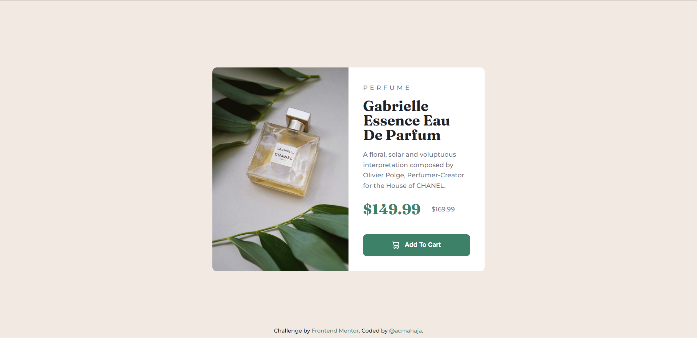

```
asd
```

# Frontend Mentor - Product preview card component solution

This is a solution to the [Product preview card component challenge on Frontend Mentor](https://www.frontendmentor.io/challenges/product-preview-card-component-GO7UmttRfa). Frontend Mentor challenges help you improve your coding skills by building realistic projects.

## Table of contents

- [Overview](#overview)
  - [The challenge](#the-challenge)
  - [Screenshot](#screenshot)
  - [Links](#links)
- [My process](#my-process)
  - [Built with](#built-with)
  - [What I learned](#what-i-learned)
  - [Continued development](#continued-development)
  - [Useful resources](#useful-resources)
- [Author](#author)
- [Acknowledgments](#acknowledgments)

## Overview

### The challenge

Users should be able to:

- View the optimal layout depending on their device's screen size
- See hover and focus states for interactive elements

### Screenshot



### Links

- Solution URL: [Github Repo](https://github.com/acmahaja/product-preview-card-component/)
- Live Site URL: [Github Page](https://acmahaja.github.io/product-preview-card-component/)

## My process

### Built with

- Semantic HTML5 markup
- CSS custom properties
- Flexbox
- CSS Grid
- Mobile-first workflow
For styles

### What I learned

Whilst building the project I learn't the following:
- You can center items using:
```css
display: grid
place-items: center;
```
- You can use the picture element to dynamically change the image souce: 

```html
<picture>
  <source srcset="images/image-product-mobile.jpg" media="(max-width: 625px)" alt="perfume mobile">
   
</picture>
```


### Useful resources

- [Picture Element](https://developer.mozilla.org/en-US/docs/Web/HTML/Element/picture) - This helped me to dynamically change the image source based on the screensize 
- [Custom Attributes](https://www.geeksforgeeks.org/what-are-custom-attributes-in-html5/#:~:text=Custom%20attributes%20are%20attributes%20that,with%20all%20the%20HTML%20elements.) - This is an amazing article which helped me understand how to use custom attributes allowing for dynamic icons


## Author

- Website - [@acmahaja](https://www.acmahaja.com)
- Frontend Mentor - [@acmahaja](https://www.frontendmentor.io/profile/acmahaja)
